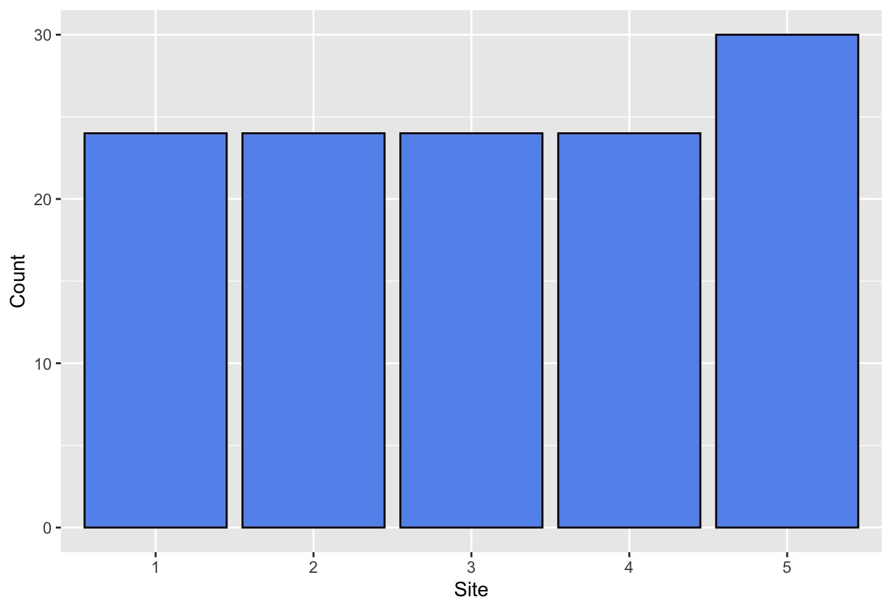
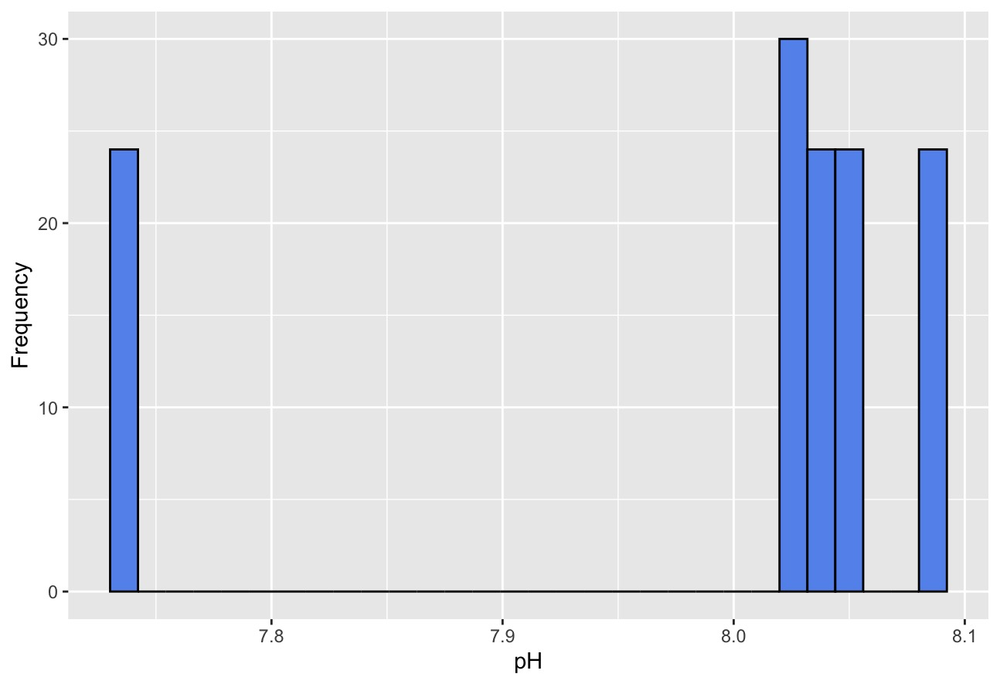
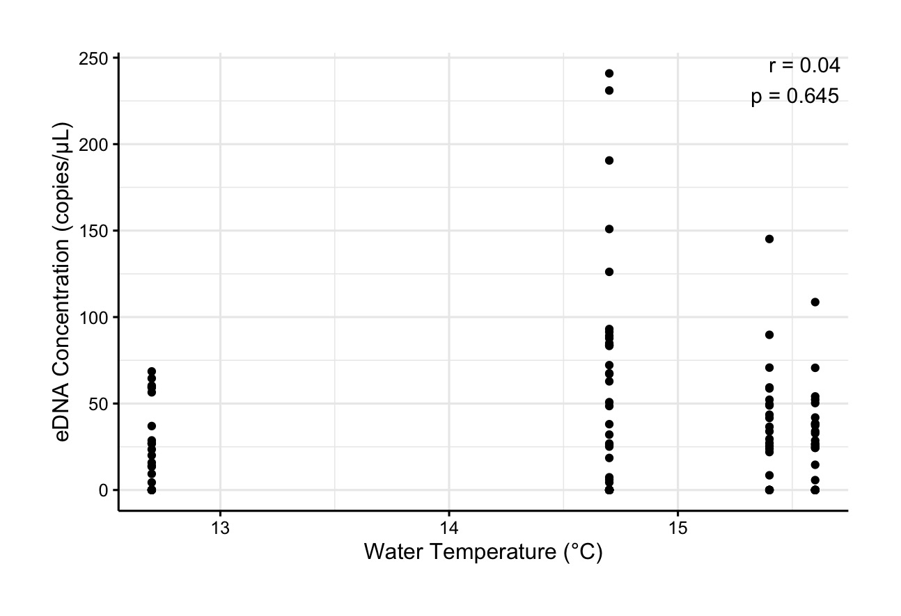
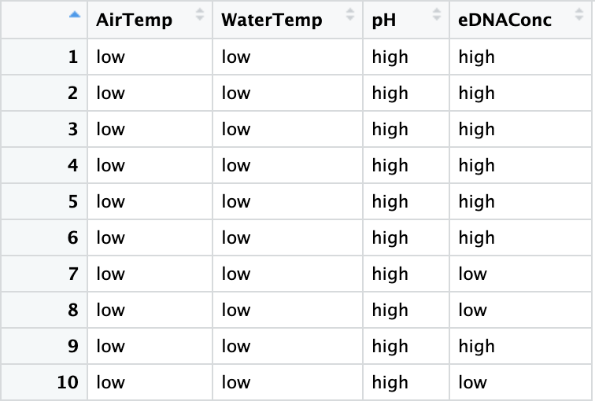
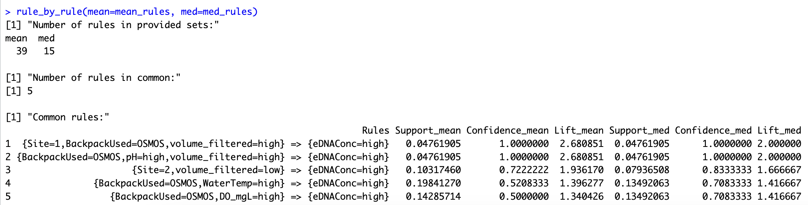
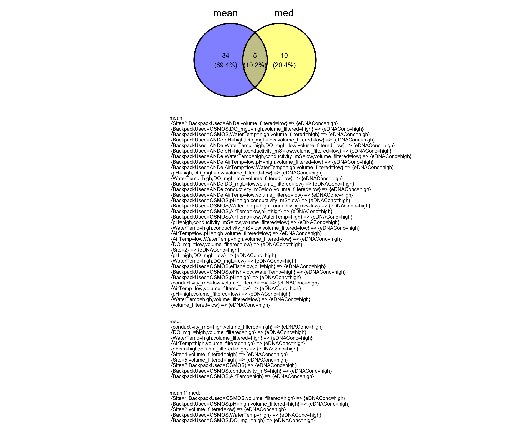

# Association Rule Mining of eDNA Datasets

This project applies association rule mining to eDNA datasets in order to determine which environmental metadata variables contribute most strongly to high eDNA concentrations in aquatic samples. 

## Navigate To...
- [Usage](#usage)
  - [plotting_funs.R](#plotting_funsr)
    - [`bar` Function](#bar-function)
    - [`his` Function](#his-function)
    - [`scatter` Function](#scatter-function)
  - [assoc_funs.R](#assoc_funsr)
    - [`dtize` Function](#dtize-function)
    - [`rule_by_rule` Function](#rule_by_rule-function)
  - [ggvenn_custom.R](#ggvenn_customr)
    - [`extract_labels` Function](#extract_labels-function)
    - [`ggvenn_custom` Function](#ggvenn_custom-function)
- [Citations](#citations)

## Usage

### plotting_funs.R

This file contains helper functions to create formatted plots of eDNA data prior to rule mining. It includes functions for barplots, histograms, and scatterplots.

#### `bar` Function

- **Purpose:** Generates a styled barplot for categorical data.
- **Parameters:**
  - `data`: The dataframe containing the column to be plotted.
  - `xvar`: The column name for the data you want to plot on the x-axis.
  - `xlab`: The label for the x-axis of the plot.
- **Example Usage:**
  ```r
  # Assuming 'df' is your dataframe and 'Site' is a column of categorical data in the dataframe:
  sites_plot <- bar(df, Site, "Site")
  print(sites_plot)
- **Example Output:** 



#### `his` Function

- **Purpose:** Generates a styled historgram for continuous data.
- **Parameters:**
  - `data`: The dataframe containing the column to be plotted.
  - `xvar`: The column name for the data you want to plot on the x-axis.
  - `xlab`: The label for the x-axis of the plot.
- **Example Usage:**
  ```r
  # Assuming 'df' is your dataframe and 'pH' is a column name in the dataframe:
  ph_plot <- his(df, pH, "pH")
  print(ph_plot)
- **Example Output:** 



#### `scatter` Function

- **Purpose:** Generates a styled scatterplot to visualize the relationship between two continuous variables, and annotates the plot with the Pearson correlation coefficient and p-value.
- **Parameters:**
  - `data`: The dataframe containing the columns to be plotted.
  - `xV`: The column name (as a string) for the data you want to plot on the x-axis.
  - `yV`: The column name (as a string) for the data you want to plot on the y-axis.
  - `labx`: The label (as a string) for the x-axis of the plot.
  - `laby`: The label (as a string) for the y-axis of the plot.
- **Example Usage:**
  ```r
  # Assuming 'df' is your dataframe, 'Temperature' is plotted on the x-axis, and 'eDNA_Concentration' on the y-axis:
  scatter_plot <- scatter(df, "Temperature", "eDNA_Concentration", "Water Temperature", "eDNA Concentration")
  print(scatter_plot)
- **Example Output:** 



### assoc_funs.R

This file contains helper functions to facilitate the discretization of data and the comparison of association rule sets. It includes functions for discretizing continuous variables and comparing two or more rulesets.

#### `dtize` Function

- **Purpose:** Discretizes continuous data in a dataframe based on provided split thresholds.
- **Parameters:**
  - `data`: The dataframe containing the columns to be discretized.
  - `split`: A dataframe containing the split thresholds for each column in the `data` dataframe. The splits must correspond to the order of columns in the dataframe.
  - `new_df`: An empty dataframe initialized with the number of columns needed to store the discretized data.
- **Example Usage:**
  ```r
  # Assuming 'df' is your original dataframe:
  ew_df <- data.frame(matrix(nrow = nrow(df), ncol = 0))
  splits <- data.frame(AirTemp = 16, WaterTemp = 25, pH = 7.75, eDNAConc = 13.3)
  discretized_df <- dtize(df, splits, new_df)
- **Example Output:** 

Before `dtize()`:


After `dtize()`:


#### `rule_by_rule` Function

- **Purpose:** Compares an indefinite number of rulesets by finding common rules and displaying their interestingness measures, such as support, confidence, and lift.
- **Parameters:**
  - `...`: An indefinite number of `rules` objects (each must be a named argument).
- **Example Usage:**
  ```r
  # Assuming 'mean_rules' and 'med_rules' are two rules objects you want to compare:
  comparison_df <- rule_by_rule(mean=mean_rules, med=med_rules)
- **Example Output:** 



### ggvenn_custom.R

This file contains a customized version of the ggvenn function from the ggvenn package by Linlin Yan. This function allows users to see the items contained in each intersection by having it printed to the R console or (optionally) displaying it directly on the venn diagram plot.

#### `extract_labels` Function

- **Purpose:** Prepares arules objects for `ggvenn_custom` by extracting the rule labels and adding newlines to improve formatting. 
- **Parameters:**
  - `...`: List of rules objects (must be named arguments).
- **Example Usage:**
  ```r
  # Assuming 'bio_rules', and 'mean_rules' are two rules objects:
  venn_rules <- extract_labels(mean=mean_rules, med=med_rules)

#### `ggvenn_custom` Function

- **Purpose:** Creates venn diagram from a list of rules labels and displays the items in each intersection to the console. Optionally, the user can set `display_element=TRUE` to annotate the venn diagram plot with the rule intersection items.
- **Parameters:**
  - `display_element`: Set to `TRUE` to annotate the venn plot with the rule intersection items.
  - All other parameters are consistent with the original ggvenn function (see citations)
- **Example Usage:**
  ```r
  # Shown with extract_labels because functions should be jointly used
  venn_rules <- extract_labels(mean=mean_rules, med=med_rules)
  ggvenn_custom(venn_rules, display_element=TRUE)
- **Example Output:** 



### Citations

- Hahsler M, Buchta C, Gruen B, Hornik K (2023). arules: Mining Association Rules and Frequent Itemsets. R package version 1.7-7, https://CRAN.R-project.org/package=arules.

- Yan, Linlin. (2023). ggvenn: Draw Venn Diagram by 'ggplot2'. R package version 0.1.10. https://CRAN.R-project.org/package=ggvenn